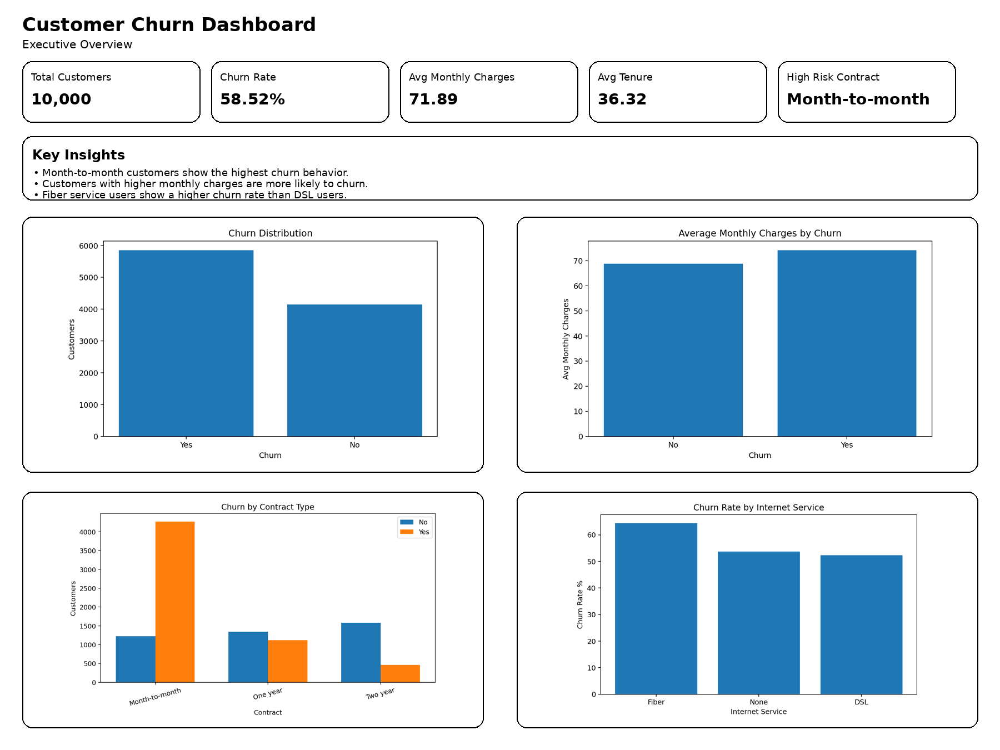
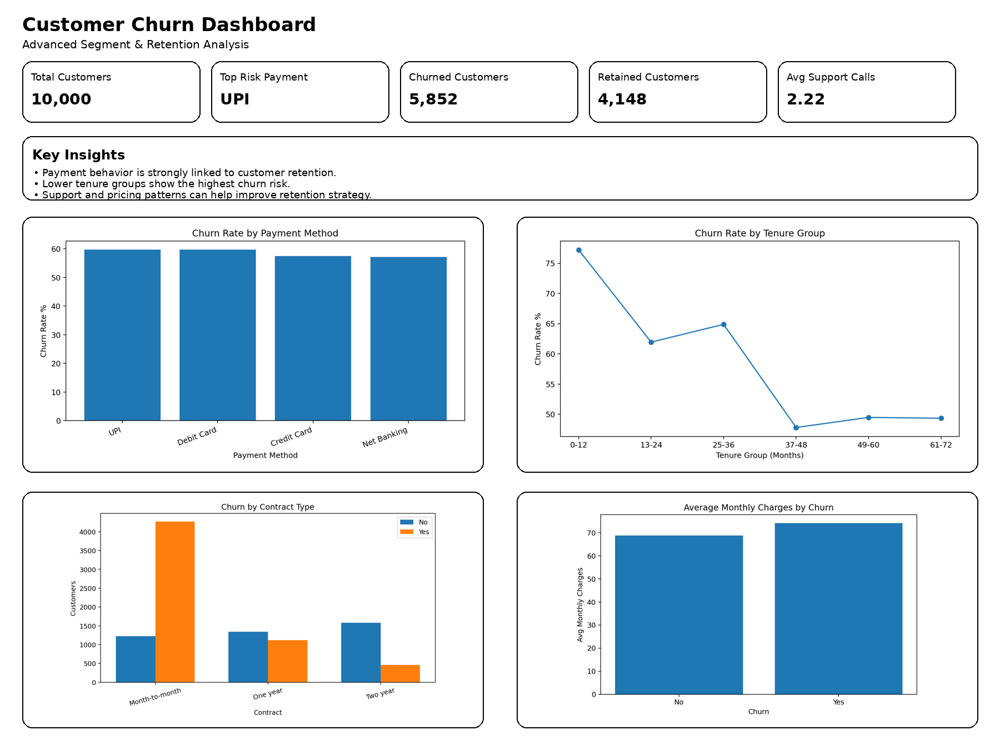

# 🚀 Customer Churn Analysis

## 📌 Overview
This project presents an end-to-end customer churn analysis solution using Python, SQL, and Power BI. It analyzes 10,000 customer records to identify churn patterns, high-risk segments, and retention opportunities.

## 🎯 Business Problem
Customer churn directly impacts business growth and recurring revenue. The goal of this project is to identify the main factors that influence churn and support retention strategy using data-driven insights.

## 📊 Project Highlights
- Analyzed **10,000+ customer records**
- Performed data cleaning and churn analysis using Python
- Wrote SQL queries for business insights
- Built dashboard-ready KPIs for retention tracking
- Designed two dashboard preview pages for executive reporting

## 🛠️ Tools & Technologies
- Python (Pandas, NumPy, Matplotlib)
- SQL
- Power BI
- CSV

## 📂 Project Structure
customer_churn_analysis/
│── README.md
│── dataset.csv
│── eda_analysis.py
│── sql_queries.sql
│── requirements.txt
│── powerbi_dashboard_guide.md
│── images/
│   ├── dashboard_preview_page1.png
│   └── dashboard_preview_page2.png

## 📈 Key KPIs
- Total Customers
- Churn Rate %
- Churned Customers
- Retained Customers
- Average Monthly Charges
- Average Tenure

## 📊 Dashboard Preview

### Page 1: Executive Overview

### Page 2: Advanced Segment & Retention Analysis

## 💡 Key Insights
- Month-to-month customers are more likely to churn.
- Higher monthly charges are linked with higher churn.
- Fiber internet users show higher churn risk.
- Short-tenure customers need stronger retention focus.

## 🚀 How to Run
pip install -r requirements.txt
python eda_analysis.py

## ✅ Conclusion

This project demonstrates how customer data can be transformed into meaningful insights to understand churn behavior and improve retention strategies. By combining Python, SQL, and dashboard visualization, it provides a complete analytics workflow from raw data to business decision-making.

## 👨‍💻 Author

**Galla Divya Teja**
Hyderabad, Telangana
📧 [y21ece036teja@gmail.com](mailto:y21ece036teja@gmail.com)
🔗 LinkedIn: https://www.linkedin.com/in/divya-teja-galla-7006592ba/
💻 GitHub: https://github.com/TejaGalla

